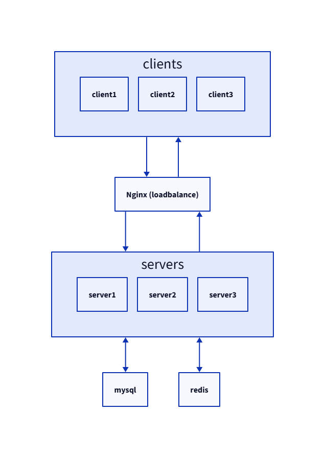
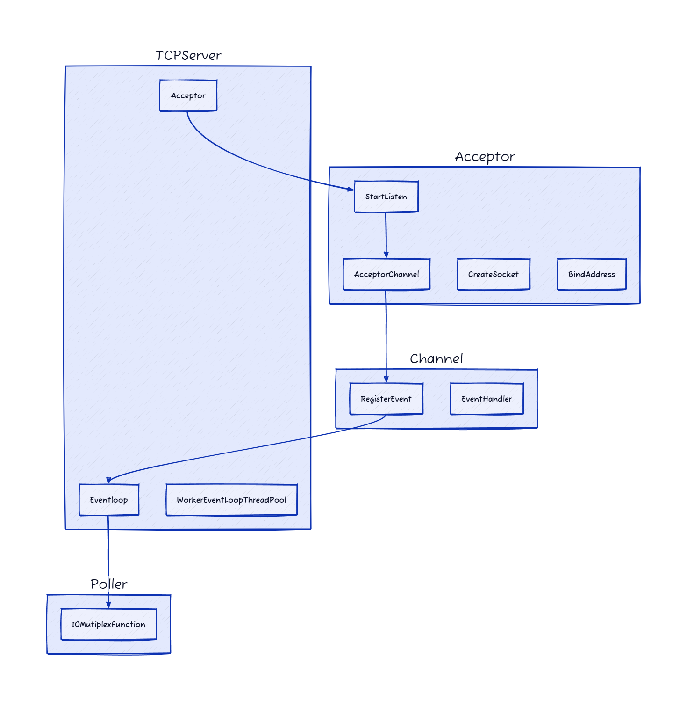
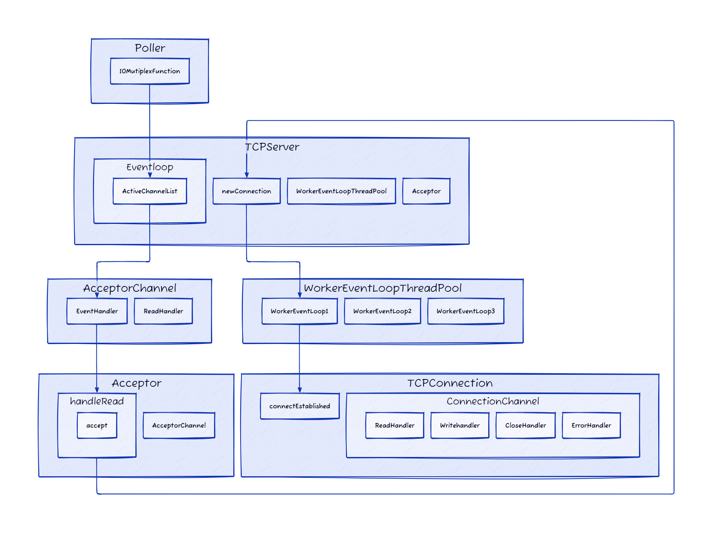
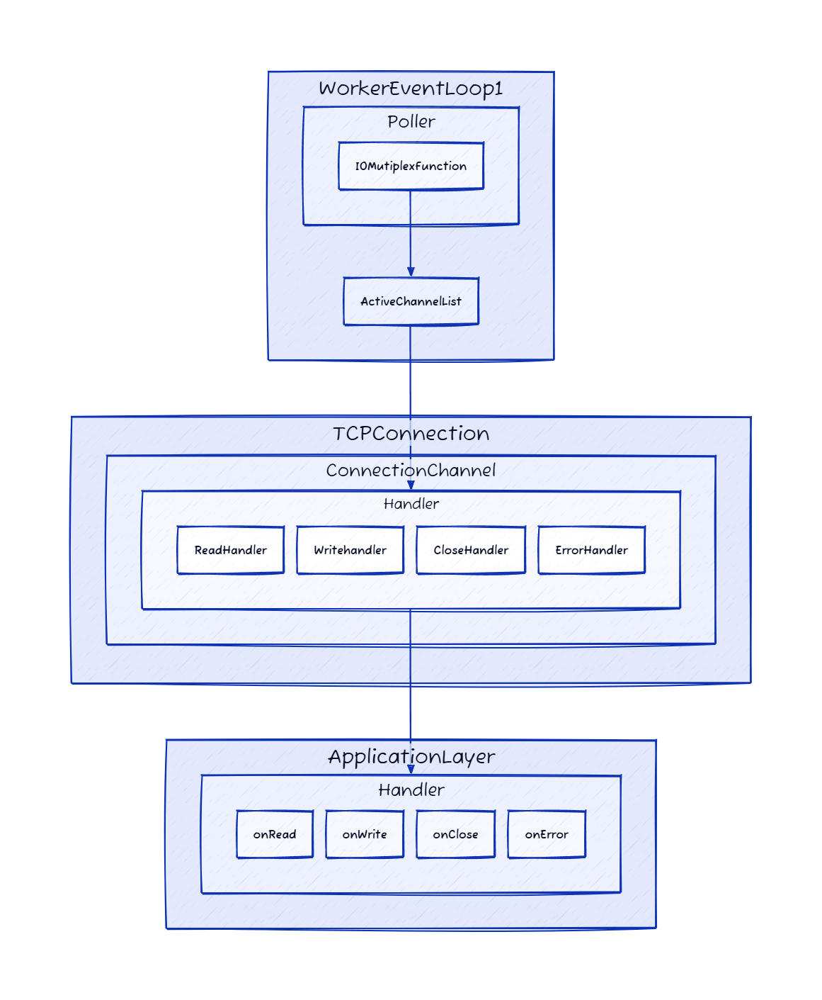
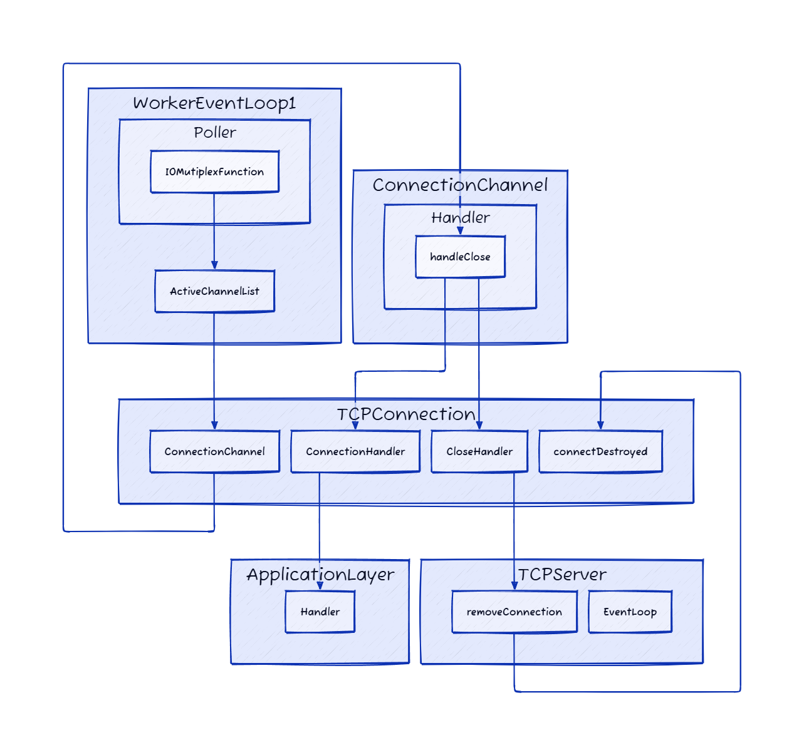
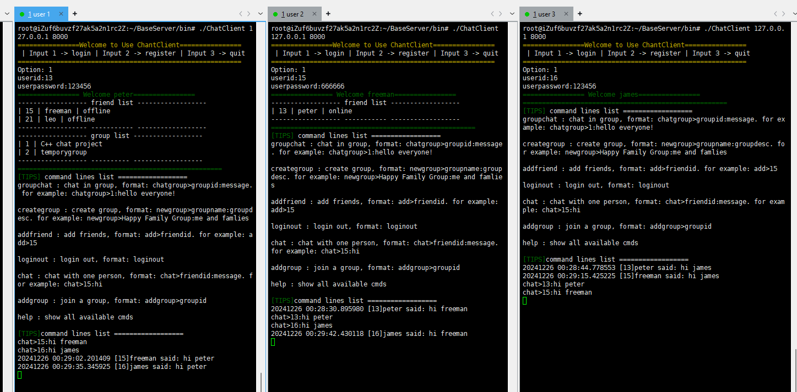

# Tiny Instant Messaging Tool - High Concurrency, High Performance

This is a tiny Instant Messaging Tool contains clients and server, and third-party tool --- ngnix, mysql and redis. 

ngnix is used to  simulating the Operation of a Server Cluster, mysql is used to store all data, redis is to handle offline message.

## Table of Contents

- [Implement Framework](#Implement Framework)
- [Features](#Features)
- [Network Framework](#Network Framework)
- [Configuration](#Configuration)
- [DEMO](#DEMO)

## Implement Framework



## Features

- Register
- Login
- Chat
- Add friend
- Group Chat
- Create Group
- Add Group
- Offline Message

## Network Framework

The network framework directly uses the network of another open-source project: https://github.com/balloonwj/flamingo

The framework adopts the boss-worker Reactor pattern.

- **Boss Reactor**: Listens for new connections and, using a thread pool, employs a round-robin distribution strategy to assign new connections to various worker Reactors.
- **Worker Reactor**: Handles read and write events for each connection, as well as other functions required by the application layer, implemented through a callback mechanism.

Main workflow:

- Start Listening



- Build Connection

  

- Handle Event

  

- Close Connection

  

## Configuration

- Ubuntu 24.04 LTS

- Build Tool：cmake 3.28.3; GNU Make 4.3, gcc version 13.3.0

- Mysql Configuration

  ```
  sudo apt update
  sudo apt install libmysqlclient-dev
  ```

- Redis Configuration

  ```
  sudo apt update
  sudo apt install libhiredis-dev
  ```

- 编译方式：

  1. unzip downloaded project
  2. cd build folder
  3. RUN`cmake ..`
  4. RUN`make -j`

- Nginx Configuration

  ```cmd
  0. mkdir nginx   
  1. weget https://github.com/nginx/nginx/releases/download/release-1.27.3/nginx-1.27.3.tar.gz
  //dependency package
  2. sudo apt update
  3. sudo apt install -y build-essential libssl-dev libpcre3-dev zlib1g-dev
  //start build nginx
  4. ./configure --with-stream
  5. make -j
  6. make install
  ```

  - add these contents in /usr/local/nginx/conf/nginx.conf

    ```
    # nginx tcp loadbalance config
    stream {
            upstream MyServer {
                    server 127.0.0.1:8081 weight=1 max_fails=3 fail_timeout=30s;
                    server 127.0.0.1:8082 weight=2 max_fails=3 fail_timeout=30s;
                    server 127.0.0.1:8083 weight=3 max_fails=3 fail_timeout=30s;
            }
            server {
                    proxy_connect_timeout 1s;
                    # proxy_timeout 3s;
                    listen 8000;
                    proxy_pass MyServer;
                    tcp_nodelay on; 
                    # tcp_nopush on;        
                    #access_log /log/nginx/stream_access.log;
            }
    }
    ```

  - START ngnix service: `/usr/local/nginx/sbin/nginx`

## DEMO



